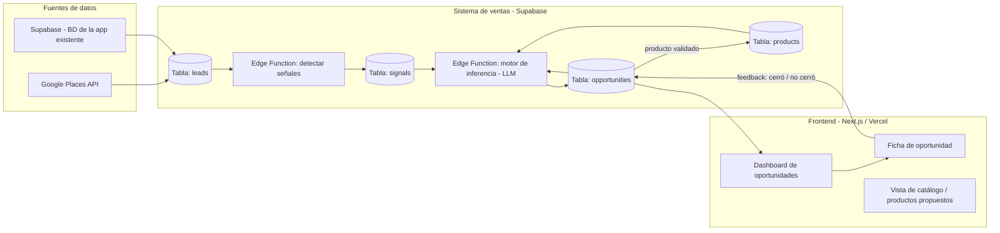

# Especificación técnica — Sistema de Inteligencia de Ventas

**Versión:** 1.0
**Fecha:** Septiembre 2026
**Autor / owner del producto:** [Tu nombre]
**Para:** Desarrollador(a) asignado(a)

---

## 1. Resumen ejecutivo

Este proyecto no es una sola app: es un **motor de decisión de ventas** reutilizable, aplicado a dos frentes del mismo dueño de producto:

1. **Prospección propia** — encontrar negocios locales (Tepic, Nayarit) sin presencia digital o con fricción operativa visible, y ofrecerles un producto/servicio de automatización.
2. **Monetización de una app existente** — identificar, dentro de la base de usuarios actual (Supabase), a los candidatos con mayor probabilidad de pagar, y sugerir *qué* ofrecerles.

La pieza diferenciadora es que el sistema **no vende de un catálogo cerrado**. Detecta una necesidad (una "señal") y, si existe un producto que la resuelve, lo sugiere; si no existe, **propone un producto nuevo en lenguaje libre**, lo marca como "propuesto" y lo deja disponible para validarse con resultados reales. El catálogo crece solo, alimentado por lo que efectivamente cierra ventas.

Todo el sistema vive sobre **un proyecto de Supabase propio**, separado del proyecto de Supabase que usa la app existente (ambos bajo la misma cuenta/plan), con un frontend en **Next.js** desplegado en **Vercel**.

> **Nota importante:** al ser dos proyectos de Supabase distintos, no hay foreign keys nativas entre la BD del sistema de ventas y la BD de la app. La lectura de datos de usuarios de la app (para detectar candidatos a pago) se hace vía una conexión cliente-a-cliente (la Edge Function del sistema de ventas se conecta también al proyecto de la app con credenciales de solo lectura), no por una relación directa en base de datos. Esto se detalla en la sección 8.4.

---

## 2. Objetivos

### 2.1 Objetivo general
Dar al dueño del producto una lista priorizada de oportunidades de venta (leads externos o usuarios internos), cada una con: **a quién**, **qué ofrecer**, **por qué**, **cómo decírselo** y **qué no hacer**, generada automáticamente a partir de datos reales y del historial de qué ha funcionado antes.

### 2.2 Objetivos específicos
- Capturar y calificar negocios locales sin presencia digital fuerte, vía Google Places API.
- Capturar y calificar usuarios internos de la app existente con alta probabilidad de conversión a pago.
- Inferir, vía LLM, la necesidad detrás de cada señal y sugerir un producto (existente o nuevo) que la resuelva.
- Registrar el resultado de cada oportunidad (cerrada / rechazada / sin respuesta) para que retroalimente futuras sugerencias.
- Permitir que el catálogo de productos crezca orgánicamente a partir de propuestas validadas.

### 2.3 Fuera de alcance (por ahora)
- Automatización de cobro / pasarela de pagos.
- Envío masivo automatizado por WhatsApp Business API (se usa `wa.me` manual en la fase 1).
- CRM completo con pipeline visual tipo Kanban (puede evaluarse en fase 3).

---

## 3. Arquitectura general



**Flujo resumido:**
1. Un lead entra (Places API o consulta interna en Supabase).
2. Se detectan señales sobre ese lead (reglas simples + heurísticas).
3. El motor de inferencia (Edge Function que llama a la API de Claude) cruza señal + catálogo + historial y genera 1-2 oportunidades con producto sugerido, guion y canal.
4. El vendedor ve la ficha, actúa, y registra el resultado.
5. El resultado se guarda y, si es un producto nuevo que cerró, pasa de "propuesto" a "validado" en el catálogo.

---

## 4. Stack tecnológico

| Capa | Tecnología | Justificación |
|---|---|---|
| Backend / BD | **Supabase** (Postgres gestionado) — **proyecto nuevo y separado** del proyecto de la app existente, bajo el mismo plan/cuenta | Aísla el sistema de ventas de la BD de producción de la app (evita riesgo sobre datos de usuarios reales). Incluye Auth, Row Level Security y Edge Functions. |
| Búsqueda semántica | **pgvector** (extensión de Supabase) | Permite comparar señales nuevas contra señales pasadas por significado, no solo texto exacto — clave para "productos que aún no existen". |
| Lógica de inferencia | **Supabase Edge Functions** (Deno) + **Claude API** (`claude-sonnet-4-6`) | Sin servidor propio que mantener. La función recibe la señal + contexto y devuelve la sugerencia estructurada en JSON. |
| Prospección externa | **Google Places API (New)** | Da nombre, categoría, zona, teléfono, sitio web (o su ausencia) y reseñas por negocio. |
| Frontend | **Next.js 14+ (App Router) + TypeScript + Tailwind CSS** | Deploy inmediato en Vercel, buen soporte de Supabase client, rápido de iterar. |
| Hosting frontend | **Vercel** | Gratis en el tier inicial, despliegue automático por git push. |
| Autenticación | **Supabase Auth** (magic link o email/password) | Un solo usuario (el dueño) al inicio; extensible a equipo de ventas después. |
| Mensajería (fase 1) | **Enlaces `wa.me`** generados dinámicamente | Sin costo, sin aprobación de Meta, suficiente para outreach manual. |
| Mensajería (fase 2, opcional) | **WhatsApp Business API** (vía Twilio o 360dialog) | Solo si se necesita automatizar el envío, no la generación del mensaje. |

**Por qué no un backend propio (Node/Express, etc.):** todo lo que este sistema necesita —tablas relacionales, funciones serverless, autenticación, vectores— ya lo da Supabase. Añadir un backend aparte duplica infraestructura sin necesidad en esta etapa.

---

## 5. Modelo de datos (Supabase / Postgres)

```sql
-- Negocios o usuarios candidatos, sin importar la fuente
create table leads (
  id uuid primary key default gen_random_uuid(),
  origen text not null check (origen in ('places_api', 'app_interna', 'redes_sociales', 'manual')),
  nombre text not null,
  tipo_negocio text,           -- ej: 'mariscos', 'cenaduria', 'clinica', null si es usuario de app
  zona text,                   -- ej: 'Ciudad del Valle', 'Centro', 'La Loma', 'Puerto Vallarta'
  perfil_url text,             -- link del perfil pegado por el vendedor (Instagram/Facebook/TikTok)
  red_social text,             -- 'instagram' | 'facebook' | 'tiktok' — se parsea automáticamente de perfil_url
  usuario_red_social text,     -- @handle — se parsea automáticamente de perfil_url
  telefono text,
  tiene_sitio_web boolean,
  google_place_id text,        -- referencia externa si viene de Places API
  app_user_id text,            -- id del usuario en la BD de la app (proyecto Supabase distinto, sin FK real)
  metadata jsonb default '{}', -- datos crudos adicionales (reseñas, horario, uso de la app, etc.)
  created_at timestamptz default now()
);

-- Señales detectadas sobre un lead: la "necesidad cruda"
create table signals (
  id uuid primary key default gen_random_uuid(),
  lead_id uuid references leads(id) on delete cascade,
  tipo_signal text not null,   -- ej: 'sin_sitio_web', 'quejas_resenas', 'uso_alto_sin_pago', 'solicita_feature'
  detalle text not null,       -- descripción en lenguaje natural de la señal
  detectado_por text default 'sistema', -- 'sistema' | 'manual'
  embedding vector(1536),      -- para búsqueda semántica de señales similares (pgvector)
  created_at timestamptz default now()
);

-- Catálogo de productos/servicios, abierto a crecer
create table products (
  id uuid primary key default gen_random_uuid(),
  nombre text not null,
  descripcion text,
  precio_base numeric,
  modelo_precio text check (modelo_precio in ('pago_unico', 'suscripcion', 'freemium')),
  estado text not null default 'propuesto' check (estado in ('propuesto', 'validado', 'descartado')),
  veces_cerrado int default 0,
  veces_rechazado int default 0,
  created_at timestamptz default now()
);

-- El cruce: este lead + esta señal + producto sugerido
create table opportunities (
  id uuid primary key default gen_random_uuid(),
  lead_id uuid references leads(id) on delete cascade,
  signal_id uuid references signals(id),
  product_id uuid references products(id), -- null si es un producto nuevo aún sin crear formalmente
  producto_sugerido_texto text,             -- usado cuando product_id es null
  razon text not null,                      -- por qué se sugiere (explicación del motor)
  canal_sugerido text,                      -- 'whatsapp' | 'en_persona' | 'email'
  guion text,                               -- mensaje/pitch generado
  precio_sugerido numeric,
  modelo_precio_sugerido text check (modelo_precio_sugerido in ('pago_unico', 'suscripcion')),
  escenario text check (escenario in ('facil', 'esceptico', 'upsell_cliente_activo')), -- calculado por el motor, no elegido a mano
  status text not null default 'pendiente' check (status in ('pendiente', 'contactado', 'cerrado', 'rechazado', 'sin_respuesta')),
  resultado_notas text,
  created_at timestamptz default now(),
  updated_at timestamptz default now()
);

-- Base de precios por zona/tipo de negocio: punto de partida, no precio fijo.
-- Editable desde el dashboard sin tocar código — el motor la usa como ancla, no como verdad absoluta.
create table pricing_baseline (
  id uuid primary key default gen_random_uuid(),
  zona text not null,                    -- ej: 'Tepic', 'Puerto Vallarta'
  tipo_negocio text,                     -- null = aplica a cualquier tipo
  producto_categoria text not null,      -- 'automatizacion_whatsapp' | 'sitio_web_simple' | 'sitio_web_corporativo'
  precio_min numeric not null,
  precio_max numeric not null,
  modelo_precio_default text check (modelo_precio_default in ('pago_unico', 'suscripcion')),
  updated_at timestamptz default now()
);

-- Índices recomendados
create index idx_signals_lead on signals(lead_id);
create index idx_opportunities_lead on opportunities(lead_id);
create index idx_opportunities_status on opportunities(status);
create index idx_signals_embedding on signals using ivfflat (embedding vector_cosine_ops);
```

**Row Level Security:** activar RLS en las 4 tablas desde el día 1, con política `auth.uid() = owner_id` si en el futuro hay más de un vendedor usando el sistema. En fase 1 (un solo usuario) puede simplificarse a "solo usuarios autenticados".

---

## 6. Motor de inferencia (Edge Function)

### 6.1 Función: `detect-signals`
**Trigger:** al insertar un nuevo lead (webhook de Supabase) o manualmente desde el dashboard.
**Input:** `lead_id`
**Lógica:**
- Si `origen = 'places_api'`: revisa `tiene_sitio_web`, reseñas en `metadata` buscando quejas frecuentes (ej. "no contestan", "tardan mucho"), y genera filas en `signals`.
- Si `origen = 'app_interna'`: corre queries sobre la BD de la app (sesiones, features usadas, días activo, si ya pagó) y genera señales como `uso_alto_sin_pago`.
**Output:** filas insertadas en `signals`.

### 6.2 Función: `infer-opportunity`
**Trigger:** al insertar una nueva señal.
**Input:** `signal_id`
**Contexto que arma antes de llamar al LLM:**
1. El detalle de la señal.
2. El catálogo completo (`products`, incluyendo propuestos).
3. Historial de oportunidades pasadas para leads del mismo `tipo_negocio` o `zona` (qué se ofreció, qué cerró, qué se rechazó).
4. Búsqueda por similitud (`pgvector`) de señales pasadas parecidas y su resultado.

**Prompt (system, resumen funcional):**
> Eres un motor de decisión de ventas. Recibes una necesidad detectada, un catálogo de productos (algunos ya validados, otros solo propuestos) y el historial de qué ha funcionado antes en casos similares. Debes responder ÚNICAMENTE con JSON: una o dos oportunidades, cada una con producto (existente o nuevo sugerido), precio, canal, guion breve en tono directo y local, y qué evitar. Si ningún producto del catálogo resuelve la necesidad, propón uno nuevo en lenguaje simple, no técnico.

**Output esperado (JSON):**
```json
{
  "oportunidades": [
    {
      "product_id": null,
      "producto_sugerido_texto": "Sistema de pedidos por WhatsApp sin comisión",
      "razon": "El negocio no tiene sitio web y las reseñas se quejan de que no contestan llamadas en hora pico",
      "canal_sugerido": "whatsapp",
      "precio_sugerido": 3800,
      "modelo_precio_sugerido": "suscripcion",
      "escenario": "esceptico",
      "guion": "Hola Don X, noté que...",
      "evitar": "No mencionar 'sitio web', enfocar en tiempo y dinero"
    }
  ]
}
```
El precio, el modelo y el escenario no son campos independientes: salen juntos del mismo cálculo descrito en 6.3 y 6.4, coherentes entre sí (ej. un escenario `esceptico` casi nunca debería traer `modelo_precio_sugerido: pago_unico`). El resultado se inserta directamente en `opportunities`.

### 6.3 Motor de precios dinámico
El precio **no sale de una tabla fija** que el vendedor consulta manualmente. Se calcula por oportunidad, dentro de `infer-opportunity`, combinando tres señales:

1. **Base por zona + tipo de negocio + categoría de producto** (`pricing_baseline`). Es un punto de partida editable, no el precio final — dos negocios en la misma zona y categoría pueden recibir precios distintos según los puntos 2 y 3.
2. **Score de crecimiento del lead.** Se deriva de señales tipo `signals` con `tipo_signal` en (`crecimiento_alto`, `crecimiento_estable`, `sin_crecimiento_visible`), calculadas a partir de indicadores disponibles según el origen del lead:
   - `places_api`: volumen y tendencia reciente de reseñas, calificación promedio, antigüedad del negocio en el directorio.
   - `redes_sociales`: frecuencia de publicación reciente, engagement relativo (si es observable en la vista previa del perfil), lo que el vendedor anotó al cargar el lead.
   - `app_interna`: frecuencia de uso, crecimiento de actividad mes a mes.
   Un score alto empuja el precio hacia el extremo superior del rango de `pricing_baseline`; un score bajo o sin señal, hacia el extremo inferior.
3. **Historial de conversión en el mismo segmento.** El motor consulta oportunidades pasadas (`opportunities`) filtradas por `zona` + `tipo_negocio` + `producto_categoria` similar: si un precio cercano cerró consistentemente, lo sugiere de nuevo o lo sube ligeramente; si se rechazó varias veces, lo baja o cambia `modelo_precio_sugerido` de `pago_unico` a `suscripcion` (mismo valor percibido, menor barrera de entrada).

`pricing_baseline` se ajusta manualmente al inicio (sin datos históricos todavía) y, después de los primeros 15-20 cierres, puede recalcularse con el promedio real de precios cerrados por segmento — esto puede automatizarse en una fase posterior al MVP con una función programada.

### 6.4 Clasificación de escenario y generación del guion
Además del precio, `infer-opportunity` clasifica cada oportunidad en un `escenario`, usado para ajustar el tono del guion generado — no como una elección manual del vendedor, sino como parte del mismo output del motor:

| Escenario | Se infiere cuando... | Ajuste en el guion |
|---|---|---|
| `facil` | Señales de adopción digital alta (negocio activo en redes, responde rápido, score de crecimiento alto) y sin historial previo de rechazo en el segmento. | Guion corto, va directo a demo y cierre con dos opciones ("¿empezamos hoy o te mando el link?"). |
| `esceptico` | Señales de resistencia (reseñas mencionando mala experiencia con tecnología previa, negocio antiguo sin presencia digital, o el propio lead marcado por el vendedor con nota de desconfianza). | Guion prioriza bajar la barrera de entrada: prueba de 3 días, `modelo_precio_sugerido` en suscripción en vez de pago único, manejo de objeciones incluido en el campo `guion`. |
| `upsell_cliente_activo` | El lead ya tiene una `opportunity` previa con `status = 'cerrado'` y el producto sigue activo. | Guion referencia el resultado real de la venta anterior (si el sistema tiene datos de uso) y sugiere el siguiente producto complementario, no uno nuevo desde cero. |

Este campo y la lógica de precio dinámico se agregan al mismo prompt del punto 6.2 — el LLM recibe el score de crecimiento, el historial del segmento y el rango base, y devuelve `precio_sugerido`, `modelo_precio_sugerido`, `escenario` y `guion` ya coherentes entre sí en una sola llamada.

### 6.5 Función: `record-outcome`
**Trigger:** manual, desde la ficha de oportunidad, cuando el vendedor marca el resultado.
**Lógica:**
- Actualiza `status` y `resultado_notas` en `opportunities`.
- Si `status = 'cerrado'` y `product_id` era null → crea el registro en `products` con `estado = 'validado'` (o si ya existía como propuesto, lo promueve) e incrementa `veces_cerrado`.
- Si `status = 'rechazado'` → incrementa `veces_rechazado` del producto asociado (si aplica).

---

## 7. Frontend (Next.js)

### 7.1 Páginas
| Ruta | Función |
|---|---|
| `/` (dashboard) | Lista de oportunidades activas, ordenadas por prioridad, con filtro por origen (prospección externa / app interna) y por zona/tipo. |
| `/oportunidad/[id]` | Ficha de oportunidad: a quién, qué ofrecer, por qué, guion listo para copiar/enviar por WhatsApp, botones de resultado (cerrado / rechazado / sin respuesta). |
| `/leads/nuevo` | Formulario para buscar y cargar leads desde Google Places API (por categoría + zona), **o pegar el link de un perfil de red social** (el sistema autocompleta red social, usuario y, si está disponible, el nombre; el vendedor solo escribe la nota de por qué es un lead). |
| `/catalogo` | Lista de productos: validados vs propuestos, con métricas (veces cerrado, veces rechazado) — permite ver qué productos nuevos está sugiriendo el sistema. |

### 7.2 Diseño / UI — lineamientos
- **Prioridad:** velocidad de lectura en móvil. El dueño del producto va a revisar esto entre viajes de Uber/inDrive, no sentado frente a un escritorio.
- **Ficha de oportunidad** como componente central: tarjeta con jerarquía clara — nombre del negocio arriba, razón en una línea, producto sugerido destacado, botón "Copiar guion" y botón "Abrir WhatsApp" (`wa.me` prellenado) muy visibles.
- **Sin dashboards de métricas pesados** en la fase 1 — una lista priorizada vale más que gráficas.
- **Paleta y tipografía:** minimalista, alto contraste, pensado para uso rápido bajo luz de sol (uso desde el celular en la calle). Tailwind con una paleta de 2 colores (neutro + un acento) es suficiente; no se requiere sistema de diseño elaborado en esta fase.
- **Estados vacíos con acción clara:** si no hay oportunidades, el dashboard debe invitar directamente a "Buscar leads nuevos", no mostrar una pantalla vacía sin salida.

### 7.3 Componentes reutilizables sugeridos
- `OpportunityCard` (usado en dashboard y detalle)
- `LeadSearchForm` (categoría + zona → llama Places API)
- `ProductBadge` (validado / propuesto / descartado, con color distinto)
- `OutcomeButtons` (cerrado / rechazado / sin respuesta)

---

## 8. Integraciones externas

### 8.1 Google Places API (New)
- Endpoint principal: Text Search / Nearby Search.
- Campos necesarios: `displayName`, `formattedAddress`, `nationalPhoneNumber`, `websiteUri`, `reviews`, `types`.
- Costo: tiene tier gratuito mensual (revisar límite vigente en la consola de Google Cloud al momento de implementar — puede haber cambiado desde esta especificación).
- Uso: se llama solo bajo demanda desde `/leads/nuevo`, no en background constante, para controlar costo.

### 8.2 Claude API
- Modelo sugerido: `claude-sonnet-4-6` (buen balance costo/calidad para generación de texto + JSON estructurado).
- Se llama exclusivamente desde Edge Functions (nunca desde el cliente, para no exponer la API key).
- Requiere definir la key como variable de entorno / secret en Supabase.

### 8.3 Conexión al proyecto Supabase de la app existente
- Son **dos proyectos Supabase separados** (dos URLs, dos sets de keys) bajo la misma cuenta.
- La Edge Function `detect-signals` (caso `origen = 'app_interna'`) se conecta al proyecto de la app usando un **service role key de solo lectura** (o, mejor aún, un usuario Postgres dedicado con permisos `SELECT` únicamente sobre las tablas necesarias — nunca reusar el service role completo de producción).
- Ambas keys (la del proyecto de ventas y la del proyecto de la app) se guardan como *secrets* en el proyecto de ventas; el proyecto de la app no necesita saber nada del sistema de ventas.
- Alternativa más simple para el MVP: en vez de que la función se conecte en vivo al otro proyecto, correr manualmente una consulta SQL en el proyecto de la app, exportar el resultado (CSV) y cargarlo a `leads` vía la página `/leads/nuevo`. Esto evita exponer credenciales entre proyectos hasta que valga la pena automatizarlo.

### 8.4 Redes sociales (Instagram / Facebook / TikTok) — captura semi-manual, entrada por link
- **No hay API pública de Meta ni de TikTok para buscar cuentas de terceros por hashtag o ubicación con fines de prospección.** Usar herramientas de scraping para esto viola los Términos de Servicio de las plataformas y arriesga el bloqueo de la cuenta usada. Por esta razón, el **descubrimiento** del lead no se automatiza en el MVP.
- **Flujo propuesto:** el vendedor navega hashtags/ubicaciones relevantes (`#tepic`, `#vallarta`, `#puertovallarta` + rubro) directamente en la app de Instagram/Facebook/TikTok. Al encontrar un negocio con señales de crecimiento pero sin lo que se vende, **solo pega el link del perfil** en `/leads/nuevo`.
- **Lo que el sistema automatiza a partir del link:**
  - Parseo del `red_social` y `usuario_red_social` directamente del URL (regex simple, sin llamadas externas).
  - Vista previa del perfil vía metadatos públicos (Open Graph: título/descripción de la página), igual que hace WhatsApp al pegar un link — es un fetch puntual a una página pública, no scraping masivo, y ayuda a autocompletar el `nombre` cuando el perfil lo expone en sus metadatos.
- **Lo que sigue siendo manual (juicio, no dato extraíble):** por qué ese negocio es un lead — se escribe en una nota libre de una línea (ej. "publica seguido, buen engagement, no tiene link de pedidos en bio") que se guarda directo como la primera `signal` del lead.
- **Evaluación futura (fase posterior al MVP):** si el volumen de prospección manual se vuelve el cuello de botella, evaluar herramientas de "social listening" con acceso legítimo (p. ej. partners oficiales de Meta) en vez de scraping directo.

### 8.5 WhatsApp (`wa.me`)
- No requiere integración de API en fase 1.
- El frontend genera el link con el mensaje codificado (`encodeURIComponent`) y lo abre en una nueva pestaña/app.

---

## 9. Requisitos no funcionales

- **Seguridad:** API keys de Google Places y Claude nunca expuestas al cliente — solo en Edge Functions / variables de entorno de servidor.
- **Autenticación:** Supabase Auth, mínimo un usuario administrador (el dueño del producto).
- **Costos objetivo fase 1:** debe poder operar dentro de los tiers gratuitos de Supabase, Vercel y Google Places API — sin gasto fijo mensual hasta validar que el sistema genera ventas.
- **Escalabilidad:** el esquema debe soportar, sin cambios estructurales, más de un vendedor usando el sistema (por eso `RLS` desde el inicio, aunque no se use con múltiples usuarios todavía).
- **Idempotencia:** volver a correr `detect-signals` sobre un lead ya procesado no debe duplicar señales idénticas.

---

## 10. Roadmap sugerido

| Fase | Entregable | Duración estimada |
|---|---|---|
| **1. Fundación** | Esquema de Supabase creado, RLS básico, Auth funcionando, deploy inicial en Vercel | 2-3 días |
| **2. Prospección externa** | Integración con Google Places API, formulario de búsqueda, carga de leads | 2-3 días |
| **3. Motor de inferencia** | Edge Functions `detect-signals` e `infer-opportunity` funcionando end-to-end con datos reales | 3-4 días |
| **4. Dashboard y ficha** | UI completa: dashboard, ficha de oportunidad, botones de resultado | 3-4 días |
| **5. Loop de catálogo** | `record-outcome` funcionando, productos propuestos que se promueven a validados | 1-2 días |
| **6. Conexión a BD de la app existente** | Query/función que detecta señales sobre usuarios internos de Supabase | 2-3 días |

---

## 11. Criterios de aceptación (MVP)

- [ ] Se puede buscar negocios por categoría + zona y guardarlos como leads.
- [ ] El sistema detecta al menos 2 tipos de señal automáticamente (sin sitio web, quejas en reseñas).
- [ ] El motor de inferencia genera al menos una oportunidad con producto, guion y canal para cada señal nueva.
- [ ] El precio sugerido se calcula dinámicamente (base por zona/tipo + score de crecimiento + historial del segmento), no se lee de una tabla fija sin ajuste.
- [ ] Cada oportunidad incluye un `escenario` (fácil / escéptico / upsell) coherente con el guion y el modelo de precio sugeridos.
- [ ] El dashboard muestra oportunidades priorizadas y permite abrir el guion listo para WhatsApp en un clic.
- [ ] Marcar una oportunidad como "cerrada" actualiza el catálogo de productos correctamente.
- [ ] Todo corre dentro de los tiers gratuitos de Supabase/Vercel/Google Places en la fase de validación.

---

## 12. Anexo — ejemplo de flujo completo (caso real)

1. Se busca "mariscos" en zona "Ciudad del Valle" vía Places API → se crean 8 leads.
2. `detect-signals` detecta que 3 de esos 8 no tienen `websiteUri` → señal `sin_sitio_web`.
3. `infer-opportunity` cruza esa señal con el catálogo (que ya tiene "Sistema de pedidos por WhatsApp" validado de un cierre anterior) → genera oportunidad con ese producto, precio $3,500, guion en tono directo.
4. El vendedor abre la ficha, copia el guion, contacta por WhatsApp.
5. Cierra la venta → marca "cerrado" → `veces_cerrado` del producto sube a +1, reforzando que ese producto es buena sugerencia para negocios similares en el futuro.
